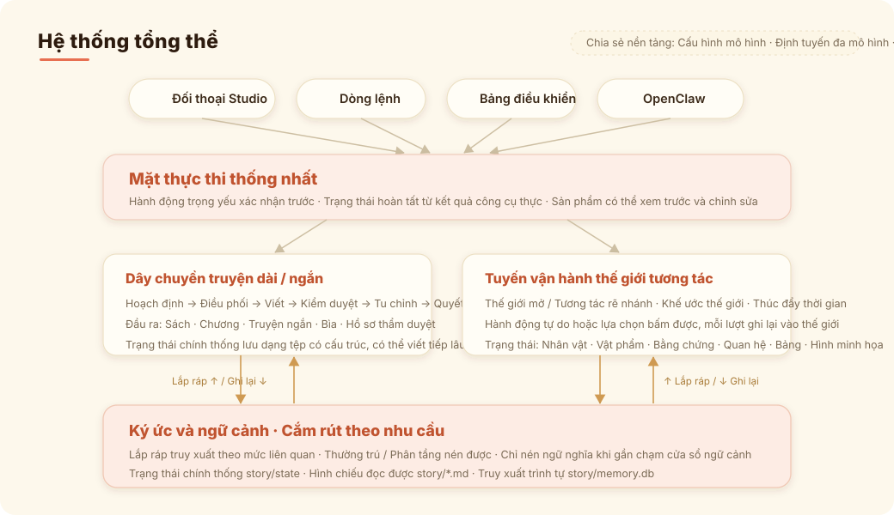
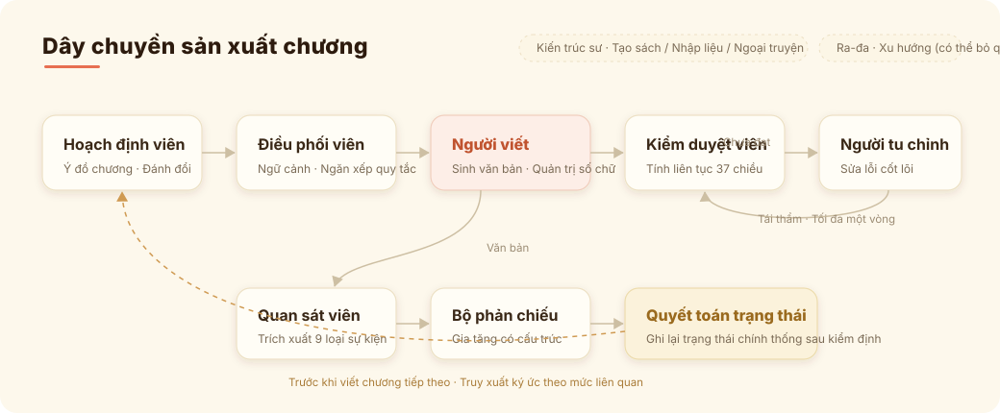
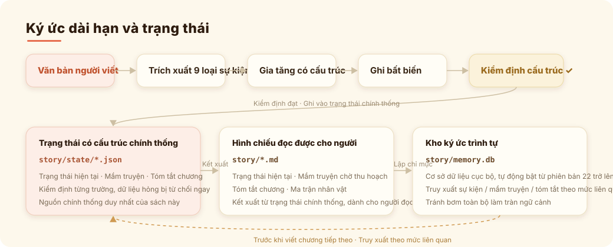

<h1 align="center">Tool Castor Story Engine</h1>

<p align="center">
  <strong>Hệ thống AI agent sáng tác cho tiểu thuyết dài và ngắn, kịch bản, phim-game tương tác, nội dung IP và dịch thuật đa ngôn ngữ (CLI: <code>castor</code>)</strong>
</p>

<p align="center">
  <a href="LICENSE"></a>
  <a href="https://github.com/Tran-Nhat-Duy1206/tool-castor-story-engine"></a>
</p>

<p align="center">
  <a href="README.en.md">English</a> | <a href="README.md">中文</a> | <a href="README.ja.md">日本語</a>
</p>

---

> **Thông báo dự án phái sinh / Derived project notice**
>
> Tool Castor Story Engine (Castor) được phái sinh từ [castor](https://github.com/Narcooo/castor) (tác giả Narcooo), sau đó đã được chỉnh sửa và phát triển mạnh mẽ, trở thành một hệ thống viết truyện AI dài kỳ độc lập. Dự án này giữ lại lịch sử Git, thông báo bản quyền và các nghĩa vụ giấy phép AGPL-3.0 của castor; mã nguồn castor thượng nguồn không phải do tác giả của dự án này viết. Phiên bản chỉnh sửa này cũng được phát hành theo giấy phép [AGPL-3.0](LICENSE).
>
> *Tool Castor Story Engine (Castor) is derived from [castor](https://github.com/Narcooo/castor) by Narcooo and has been substantially modified and evolved into an independent long-form AI story-writing system. This project preserves castor's Git history, copyright notices and AGPL-3.0 obligations. The original castor code was not authored by the maintainers of this project. This modified work remains licensed under AGPL-3.0.*

---

Tool Castor Story Engine (Castor) là một hệ thống AI agent dành cho sáng tác truyện và dịch thuật đa ngôn ngữ: truyện dài kỳ, truyện ngắn độc lập, kịch bản, ngoại truyện dựa trên tác phẩm gốc, viết tiếp mô phỏng phong cách, phim-game tương tác, thế giới mở và dịch văn bản dài — tất cả đều bắt đầu từ cùng một bàn làm việc. Hỗ trợ các hình thức tương tác Studio, TUI và CLI (`castor`), giao cho agent quản lý thống nhất ý tưởng, bối cảnh thiết lập, nhân vật, bộ nhớ, duyệt bản nháp, chỉnh sửa, bìa, trạng thái tương tác và bàn giao đa ngôn ngữ. Điểm cốt lõi là **Phase 4 – Quy trình con người kiểm duyệt trạng thái sau mỗi chương (Human-Governed Post-Chapter State Review)**: AI chỉ tạo đề xuất, con người quyết định rồi xác nhận theo kiểu nguyên tử; mọi chỉnh sửa nội dung chính đều lập tức kích hoạt quy trình duyệt lại.

## v1.8.0 - Hợp nhất Pi Agent Harness và lõi sáng tác chuyên nghiệp

Castor 1.8.0 gộp "chat agent gọi công cụ" và "các pipeline loại tác phẩm" thành một harness sản xuất thống nhất xoay quanh pi-agent. Mô hình chịu trách nhiệm hiểu, đề xuất và gọi năng lực; Castor chịu trách nhiệm xác nhận, ngữ cảnh, trạng thái, ghi đĩa nguyên tử và tính xác thực của sản phẩm. Truyện dài, truyện ngắn, kịch bản, phân cảnh, phim-game tương tác, Play và dịch thuật vẫn giữ phương pháp chuyên biệt riêng, nhưng dùng chung một hạ tầng thực thi, truy xuất, quan sát và phục hồi.

- **Cấu hình mô hình**: Studio tích hợp sẵn cấu hình nhiều nhà cung cấp, định tuyến mô hình và cấu hình dịch vụ bìa; hỗ trợ các cổng tổng hợp mô hình toàn cầu như [kkaiapi](https://kkaiapi.com/) / OpenRouter, cùng dịch vụ tùy chỉnh tương thích OpenAI.
- **Harness sản xuất thống nhất**: Studio Chat, TUI, `castor interact` và production worker dùng chung vòng lặp công cụ pi-agent với action/result có cấu trúc; các pipeline cũ trở thành năng lực xác định, gọi trực tiếp được, có thể ngắt và quan sát được, không còn duy trì một nhân quyết định ngôn ngữ tự nhiên song song.
- **15 Skills chuyên nghiệp tích hợp sẵn**: viết truyện dài / duyệt bản nháp, truyện ngắn thương mại, Play, kịch bản, phân cảnh, phim-game tương tác, dịch thuật, tách bản, nghiên cứu thị trường, nhập liệu, bìa và khử dấu vết AI đều có `SKILL.md` riêng; mỗi loại tác phẩm tái sử dụng kiến trúc Skill chứ không tái sử dụng prompt truyện dài không phù hợp với mình.
- **Truy xuất cục bộ thống nhất**: bộ nhớ truyện, kho tài liệu và tài liệu tham khảo của Skill dùng chung lớp chiếu truy xuất SQLite FTS5 / BM25; tệp gốc vẫn là nguồn chính thống, chỉ mục có thể xây dựng lại, kết quả truy xuất giữ nguồn và vị trí.
- **Gắn tài liệu tham khảo với sách**: tài liệu nhập vào có thể gắn rõ ràng với một cuốn sách kèm khai báo mục đích; khi viết, hệ thống truy xuất các đoạn liên quan theo nhiệm vụ hiện tại thay vì nhét toàn văn mọi tệp vào ngữ cảnh.
- **Không gian làm việc chương an toàn**: nội dung, trạng thái, tiền bố và ảnh chụp trạng thái runtime được xác thực trong không gian làm việc của chương trước khi commit nguyên tử; khi thất bại sẽ không xảy ra hiện tượng "trạng thái đã tiến nhưng nội dung chưa ghi đĩa". Studio có thể xem không gian làm việc viết lại và các vấn đề duyệt bản nháp thực tế.
- **Nhất quán sản xuất xuyên tác phẩm**: Short, kịch bản, phân cảnh, phim-game tương tác, Play và dịch thuật đều nối vào run snapshot thống nhất, gắn Skill, quan sát số chữ, tín hiệu hủy và phục hồi lỗi, đồng thời giữ mô hình trạng thái và quy tắc sáng tác riêng.
- **Nhiệm vụ dài và gọi mô hình ổn định hơn**: viết nhiều chương chạy theo một nhiệm vụ có thể phục hồi theo thứ tự; thời gian chờ token đầu / idle khi stream, tự sửa trạng thái hết hạn và tập tệp nguyên tử giảm khả năng bị treo hoặc dở dang.
- **TUI ngang hàng Studio**: bổ sung các lối vào rõ ràng `/new`, `/short`, `/play`, `/cover`, `/write`, `/confirm` / `/cancel` có cấu trúc, chuyển `/model` theo phiên và bảng màu tự thích ứng terminal sáng/tối; văn bản tự do thông thường vẫn do Agent tự hiểu.
- **Bổ sung mô hình và bàn làm việc**: thêm dịch vụ cục bộ LM Studio; danh mục mô hình động và nhập bản gốc từ bên ngoài có thể lưu lâu dài; Studio hỗ trợ Base URL bìa tùy chỉnh, xem trước chương màn hình rộng và viết lại chương an toàn.

<p align="center">
  
  
</p>

### Các hình thức sáng tác chính

**Tiểu thuyết dài kỳ** — tạo sách từ brief sáng tác, sinh thế giới quan, nhân vật, đại cương tập và ý định chương, tiến hành theo chu trình "viết → duyệt → chỉnh sửa khi cần → kết toán trạng thái". Ngữ cảnh được tổ chức theo lớp protected / compressible để tránh cuốn sách càng dài càng rối.

**Suy diễn đa nhánh cốt truyện** — trước khi viết chương tiếp theo, dựa trên chính thống hiện tại sinh ra 2-5 nhánh tương lai tách biệt nhau, so sánh ngang trong Studio Chat về nhịp chương, quyết định nhân vật, thay đổi dự kiến, rủi ro và mức khớp ý đồ tác giả. Chấp nhận một nhánh chỉ lưu kế hoạch ứng viên `selected-branch-plan.md`, không sửa nội dung, đại cương hay trạng thái chính thống; khi chính thống thay đổi, các suy diễn cũ sẽ bị đánh dấu hết hạn.

**Castor Short** — Studio Chat và CLI có thể tạo truyện ngắn độc lập trực tiếp: nội dung hoàn chỉnh, bản ghi đại cương, bản ghi duyệt bản nháp, giới thiệu bán hàng, prompt bìa, và sinh ảnh bìa sau khi cấu hình dịch vụ bìa.

**Castor Play** — bổ sung thế giới mở và tương tác phân nhánh. Bạn có thể dùng ngôn ngữ tự nhiên để chỉ định hợp đồng thế giới, cách thời gian trôi, agent nhân vật, quy tắc vật phẩm / bằng chứng / quan hệ và phong cách thị giác; hệ thống duy trì trạng thái thế giới, lựa chọn bấm được, hành động tự do, HUD và ảnh minh họa tự động.

**Studio Chat** — chat thông thường, tạo sách, truyện ngắn, bìa, thế giới tương tác đều đi qua cùng một action surface. Hành động nặng phải xác nhận trước, sản phẩm sinh ra có thể xem trước, có thể chỉnh chương, prompt bìa, trạng thái thế giới và sản phẩm văn bản lưu lâu dài qua chat.

**Hỗ trợ viết tiểu thuyết tiếng Anh gốc!** Đặt `--lang en` để viết bằng tiếng Anh. Xem [README tiếng Anh](README.en.md) để biết chi tiết.

## Cùng trao đổi

> Hiện tại cập nhật khá thường xuyên, sau này sẽ tiếp tục bổ sung tính năng và tối ưu chất lượng viết.
> Rất hoan nghênh bạn vào nhóm phản hồi lỗi, đề xuất nhu cầu, và theo dõi tiến độ dự án — mục tiêu của chúng ta là xây dựng AI Agent sáng tác nội dung dựa trên tiểu thuyết mạnh nhất.

<p align="center">
  
</p>

## Bắt đầu nhanh

### Cài đặt

Cần **Node.js 22 trở lên**.

```bash
git clone https://github.com/Tran-Nhat-Duy1206/tool-castor-story-engine.git
cd tool-castor-story-engine
pnpm install
pnpm build
```

> Gói npm của castor thượng nguồn (`@actalk/castor`) và [OpenClaw Skill](https://clawhub.ai/narcooo/castor) vẫn thuộc về dự án castor của Narcooo; kho độc lập này xây dựng và sử dụng từ mã nguồn. Dữ liệu người dùng cũ, cấu hình `castor.json`, biến môi trường `castor_*` và cấu trúc thư mục sách vẫn giữ tương thích; lệnh `castor` có thể nạp trực tiếp các dự án castor có sẵn.

### Dùng qua OpenClaw 🦞

castor thượng nguồn đã được phát hành dưới dạng [OpenClaw](https://clawhub.ai/narcooo/castor) Skill. Kho này phái sinh từ castor và kế thừa cùng một bộ lối vào tương tác chia sẻ; sau khi xây từ mã nguồn có thể gọi trực tiếp:

```bash
castor interact --json --message "Tiếp tục cuốn sách hiện tại nhưng siết nhịp lại một chút"
```

Lối vào này đi thẳng vào nhân thực thi tương tác giống hệt TUI của dự án, vì vậy OpenClaw, TUI và Studio dùng chung một "bộ não điều khiển". Hiện tại đầu ra JSON gồm phản hồi văn bản của assistant và thông tin interaction session; kết quả thực thi thực sự căn cứ vào tool result và tệp ghi đĩa, không suy diễn hoàn thành từ lời mô hình.

Các lệnh nguyên tử `plan chapter` / `compose chapter` / `draft` / `audit` / `revise` / `write next` vẫn được giữ lại, nhưng phù hợp hơn làm công cụ tầng dưới thay vì lối vào ưu tiên của OpenClaw.

### Agent Skills

Castor sử dụng trực tiếp chuẩn `SKILL.md` làm phần mở rộng năng lực chuyên môn, không còn duy trì một giao thức Skill riêng tư của Castor. Skill chỉ cung cấp hướng dẫn chuyên môn và tài liệu tham khảo tĩnh cho Chat Agent, không tăng quyền thực thi; việc tạo, ghi, chỉnh sửa và sinh ảnh vẫn do công cụ của Castor và cổng xác nhận kiểm soát.

Cách sử dụng:

- Đặt vào thư mục chuẩn: `skills/` của dự án, `.agents/skills/`, hoặc thư mục người dùng `~/.agents/skills/`, `~/.openclaw/skills/`. Studio cũng có thể nhập cả thư mục chứa `SKILL.md` và tài liệu tham khảo tĩnh; nhập ở mức dự án được lưu thống nhất vào `.agents/skills/`.
- Hoặc đặt `CASTOR_SKILL_DIRS=/abs/path/to/skills`, có thể trỏ tới một thư mục skill đơn lẻ hoặc thư mục chứa nhiều thư mục con skill. Nhiều thư mục phân tách bằng dấu phân cách hệ thống.
- Trong Chat dùng `@skill-id` để ép dùng trong lượt này, ví dụ: `@detective-play làm một thế giới mở dựa trên chuỗi bằng chứng`.
- Khi không viết `@skill-id`, Chat Agent sẽ tự quyết định có gọi `use_skill` hay không dựa trên ý định hiện tại của người dùng; không còn bật máy móc theo loại session, từ khóa hay khớp chuỗi con.
- Skill bên ngoài chỉ cung cấp chỉ dẫn và tài liệu tham khảo tĩnh; Castor không tự thực thi script trong đó, cũng không vượt qua quyền công cụ và cổng xác nhận hiện có.

Cấu hình prompt không phải là Skill. Studio quản lý riêng prompt packs tại **Cài đặt dự án → Prompt**, tệp ghi đè cấp dự án ghi vào `prompt/<pack>/<prompt>.md`, ví dụ `prompt/play/renderer.md`, `prompt/longform/writer.md`.

Ví dụ `SKILL.md` tối thiểu:

```md
---
name: Detective Play
description: Detective evidence and suspect-board play.
---
Use evidence chains; do not turn clues into generic atmosphere.
```

### Cấu hình

Hiện tại Castor chia cấu hình LLM thành hai lộ trình rõ ràng: **Studio dùng cấu hình dịch vụ trực quan**, **CLI / daemon / môi trường triển khai hỗ trợ ghi đè bằng env**. Hai bên không làm nhiễu lẫn nhau.

#### Cách 1: Cấu hình dịch vụ trong Studio (khuyến nghị)

Phù hợp cho viết cục bộ, bàn làm việc Web và quản lý trực quan.

```bash
castor init my-novel
cd my-novel
castor
```

Mở Studio và vào "Cấu hình mô hình":

1. Chọn nhà cung cấp, ví dụ Google Gemini, Moonshot, MiniMax, Zhipu, Bailian hoặc endpoint tùy chỉnh.
2. Dán API Key, bấm "Kiểm tra kết nối".
3. Chọn mô hình khả dụng, lưu cấu hình.
4. Quay lại trang sách và bắt đầu viết.

Khi chạy, Studio chỉ dùng:

```text
giá trị mặc định provider bank
→ services / service hiện tại / defaultModel trong castor.json
→ API Key của service trong .castor/secrets.json
```

Dù phát hiện thấy `~/.castor/.env` hoặc `.env` của dự án, Studio cũng chỉ hiển thị gợi ý, không dùng env để ghi đè service, model, baseUrl hay API Key. API Key được lưu trong `.castor/secrets.json` của dự án, không ghi vào `castor.json`.

#### Cách 2: Cấu hình env cho CLI / daemon / môi trường triển khai

Phù hợp cho xử lý lô trên terminal, triển khai máy chủ, CI, Docker, daemon và chuyển mô hình tức thời.

Env toàn cục:

```bash
castor config set-global \
  --provider <openai|anthropic|custom> \
  --base-url <địa chỉ API> \
  --api-key <API Key của bạn> \
  --model <tên mô hình>
```

Cũng có thể tự ghi `~/.castor/.env` hoặc `.env` của dự án:

```bash
CASTOR_LLM_PROVIDER=custom
CASTOR_LLM_BASE_URL=https://api.moonshot.cn/v1
CASTOR_LLM_API_KEY=sk-...
CASTOR_LLM_MODEL=kimi-k2.5

# Tùy chọn
CASTOR_LLM_SERVICE=moonshot                         # Khuyến nghị ghi; nếu không ghi sẽ tự nhận diện từ baseUrl
CASTOR_LLM_TEMPERATURE=0.7
CASTOR_LLM_THINKING_BUDGET=0
CASTOR_DEFAULT_LANGUAGE=zh
CASTOR_LLM_EXTRA_top_p=0.9
```

Thứ tự hợp thành của CLI:

```text
Cấu hình service của Studio/dự án
→ service key trong .castor/secrets.json
→ global ~/.castor/.env
→ project .env
→ biến môi trường tiến trình hiện tại
→ tham số CLI
```

Nghĩa là CLI mặc định có thể tái sử dụng service và key đã cấu hình trong Studio; nếu env khai báo `CASTOR_LLM_SERVICE`, `CASTOR_LLM_MODEL`, `CASTOR_LLM_BASE_URL` hoặc `CASTOR_LLM_API_KEY`, chúng sẽ có hiệu lực như một lớp ghi đè. Env cũ chỉ ghi `baseUrl + model + apiKey` vẫn dùng được, Castor sẽ cố suy ra service từ baseUrl.

Chỉ định service hoặc mô hình cho một lần chạy:

```bash
castor write next --service google --model gemini-2.5-flash
castor write next --service moonshot --model kimi-k2.5 --no-stream
castor agent "Viết tiếp chương sau" --api-key-env MOONSHOT_API_KEY
castor doctor --service minimaxCodingPlan --model MiniMax-M2.7
```

`--service` tự suy ra baseUrl, giao thức và chiến lược tương thích từ provider bank; `--model` phải thuộc về service cuối cùng, nếu không sẽ báo lỗi ngay để tránh lỗi gửi mô hình Kimi sang Gemini.

#### Cách 3: Định tuyến đa mô hình (tùy chọn)

Gán mô hình khác nhau cho các agent khác nhau, cân bằng chất lượng và chi phí theo nhu cầu:

```bash
# Cấu hình mô hình/nhà cung cấp khác nhau cho từng agent
castor config set-model writer <model> --provider <provider> --base-url <url> --api-key-env <ENV_VAR>
castor config set-model auditor <model> --provider <provider>
castor config show-models        # Xem định tuyến hiện tại
```

Agent nào không cấu hình riêng sẽ tự dùng mô hình toàn cục.

#### Chẩn đoán cấu hình

```bash
castor doctor
```

`doctor` hiển thị effective config mode hiện tại, nguồn của service/model/API Key, và thử kiểm tra kết nối API. Các mode thường gặp:

| Mode             | Ý nghĩa                                                            |
| ---------------- | ------------------------------------------------------------------ |
| `studio-project` | Khi Studio chạy: chỉ dùng cấu hình Studio/dự án và secrets          |
| `cli-project`    | Khi CLI chạy: dựa trên cấu hình Studio, cộng thêm env và tham số CLI |
| `legacy-env`     | Mode env cũ: tương thích cấu hình thuần `.env` của dự án cũ          |

Nếu kiểm tra service thất bại, ưu tiên kiểm tra nhà cung cấp, mô hình và giao thức có khớp không. API Key AI Studio của Google Gemini dùng được cho endpoint tương thích OpenAI của Gemini; Castor sẽ tự tắt tham số `store` của OpenAI mà Google không hỗ trợ. MiniMax mặc định đi qua `/v1/chat/completions` tương thích OpenAI chính thức, và ưu tiên transport không stream hoạt động được, tránh lỗi stream trả usage nhưng không có nội dung; `MiniMax-M3*` mặc định tắt trả về thinking, còn thinking của M2.x do giới hạn thượng nguồn không tắt được.

### Cập nhật cấu hình LLM

- **Cách ly cấu hình Studio / CLI**: Studio cố định dùng cấu hình trang dịch vụ và `.castor/secrets.json`; CLI, daemon, môi trường triển khai hỗ trợ ghi đè env và tham số lệnh tức thời.
- **Bảng năng lực provider bank**: tích hợp sẵn baseUrl, giao thức, mô hình và chiến lược tương thích của các service Google Gemini, Moonshot, MiniMax, Zhipu, Bailian, DeepSeek, SiliconFlow, Volcano, Tencent Hunyuan, Wenxin, iFlytek Spark, OpenRouter, kkaiapi, Ollama, CodingPlan, v.v.
- **Kiểm tra quyền sở hữu mô hình**: cấu hình sai như `--service google --model kimi-k2.5` sẽ báo lỗi ngay, tránh gửi yêu cầu đến sai nhà cung cấp.
- **Sửa lỗi tương thích Google Gemini**: API Key AI Studio dùng trực tiếp được cho endpoint tương thích OpenAI của Gemini; Castor tự tắt tham số `store` của OpenAI mà Google không hỗ trợ.
- **Dò transport MiniMax**: MiniMax / MiniMax CodingPlan dùng lối vào `/v1` tương thích OpenAI chính thức, và tự động dùng transport không stream hoạt động được, né lỗi stream usage bình thường nhưng nội dung rỗng.
- **Tương thích env cũ**: bộ `CASTOR_LLM_BASE_URL + CASTOR_LLM_MODEL + CASTOR_LLM_API_KEY` cũ vẫn dùng được cho CLI; thiếu `CASTOR_LLM_SERVICE` sẽ thử suy nhà cung cấp từ baseUrl.

### Các lối vào tương tác hiện tại

**Studio Chat + CLI + TUI dùng chung một mặt thực thi**

- **Studio Chat**: thảo luận, tạo sách, truyện ngắn, bìa, Play, chỉnh tệp lưu lâu dài đều khởi phát từ cùng một lối vào hội thoại; hành động nặng sẽ hiện thẻ xác nhận trước.
- **Lối vào bắt đầu sáng tác**: truyện dài, truyện ngắn, fanfic, ngoại truyện, mô phỏng phong cách, viết tiếp, tương tác phân nhánh, thế giới mở đều vào từ khu vực đầu trang của Studio.
- **Bảng điều khiển TUI**: `castor tui` để vào tương tác toàn màn hình terminal; hỗ trợ `/new`, `/short`, `/play`, `/cover`, `/write`, `/confirm`, `/cancel` và `/model <tên mô hình>` theo phiên.
- **Lối vào agent bên ngoài**: `castor interact --json --message "..."` vẫn là lối vào có cấu trúc cho OpenClaw / các agent khác.
- **Giữ nguyên lệnh nguyên tử**: `plan` / `compose` / `draft` / `audit` / `revise` / `write next` vẫn phù hợp cho script và người dùng nâng cao.

### Viết cuốn sách đầu tiên

```bash
castor book create --title "Ma Đế Thôn Thiên" --genre xuanhuan  # Tạo sách mới
castor write next Ma Đế Thôn Thiên      # Viết chương tiếp (nháp → audit → chỉnh sửa theo cấu hình)
castor status                   # Xem trạng thái
castor review list Ma Đế Thôn Thiên     # Duyệt bản nháp
castor review approve-all Ma Đế Thôn Thiên  # Duyệt hàng loạt
castor export Ma Đế Thôn Thiên          # Xuất bản toàn bộ sách
castor export Ma Đế Thôn Thiên --format epub  # Xuất EPUB (đọc trên điện thoại/Kindle)
```

### Viết truyện ngắn hoàn chỉnh

Muốn tạo trực tiếp một truyện ngắn hoàn chỉnh, có thể nói trong hội thoại Studio:

```text
Viết truyện ngắn 12 chương, hướng là: đảo ngược tình huống hôn nhân đô thị, nữ chính cầm bằng chứng sổ sách rồi phản kích.
```

Hoặc đi qua CLI:

```bash
castor short run \
  --direction "Truyện ngắn đô thị đảo ngược hôn nhân nữ chính dùng bằng chứng phản kích" \
  --chapters 12 \
  --chars 1000
```

Sản phẩm sẽ nằm trong `shorts/<tên truyện>/final/`, gồm `full.md`, `sales-package.md`, `cover-prompt.md`; sau khi cấu hình dịch vụ bìa còn sinh thêm `cover.png`.

### Làm riêng một cái bìa

Nếu chỉ muốn làm bìa cho tiêu đề hoặc giới thiệu có sẵn, không cần chạy lại nội dung truyện ngắn, hãy nói trực tiếp trong hội thoại Studio:

```text
Sinh một cái bìa truyện ngắn cho "Ngày cô ấy ký đơn ly hôn, anh ấy hối hận phát điên", thiên hiện đại đô thị, đảo ngược mạnh.
```

Công cụ bìa sẽ độc lập sinh `covers/<tiêu đề>/cover-prompt.md` và `covers/<tiêu đề>/cover.png`. Nếu chưa cấu hình dịch vụ bìa, hãy thiết lập dịch vụ bìa và API Key trong phần cấu hình mô hình của Studio trước.

Sau khi sinh, có thể tiếp tục chỉnh prompt bìa qua chat, ví dụ "đưa nhân vật lại gần hơn, chữ tiêu đề to hơn, biểu cảm lạnh lùng hơn". Hệ thống sẽ dùng `coverPrompt` mới ghi đè `cover-prompt.md` và sinh lại bìa, không cần viết lại truyện ngắn.

### Khởi động thế giới mở / tương tác phân nhánh

Trong Studio Chat chọn "Thế giới mở" hoặc "Tương tác phân nhánh", mô tả trực tiếp bằng ngôn ngữ tự nhiên thế giới bạn muốn chơi:

```text
Làm một thế giới mở kiểu Warcraft với tháp canh biên giới. Thời gian không theo lượt cố định, tuần tra một giờ, tu luyện có thể kéo dài vài ngày. Trang bị có độ hiếm, nhưng không cần bảng số liệu, thể hiện qua chất liệu và độ bóng.
```

Hệ thống sẽ sinh thế giới, nhân vật, vật phẩm, bằng chứng, quan hệ, cảnh hiện tại và các hành động khả dụng. Thế giới mở hỗ trợ nhập hành động tự do; tương tác phân nhánh sẽ đưa ra các lựa chọn bấm được. Sau khi cấu hình dịch vụ bìa / ảnh, nhân vật, vật phẩm, bằng chứng, cảnh vật đều có thể sinh ảnh và hiển thị cuộn trong dòng hội thoại.

---

## Tính năng cốt lõi

### Studio Chat + Action Surface

Studio Chat không còn chỉ là khung hỏi đáp. Nó có thể tạo truyện dài, chạy truyện ngắn, sinh bìa, khởi động Play, chỉnh tệp văn bản lưu lâu dài, và đưa ra xác nhận trước khi thực hiện hành động nặng. Thảo luận thông thường được trả lời trực tiếp; chỉ các hành động sáng tác rõ ràng mới vào thực thi công cụ.

### Castor Play: thế giới mở và tương tác phân nhánh

Play duy trì một trạng thái thế giới có thể tiếp tục phát triển: nhân vật, địa điểm, vật phẩm, bằng chứng, quan hệ, thời gian, cảnh và HUD. Đây không phải mẫu RPG cứng nhắc — bạn có thể định nghĩa hợp đồng thế giới bằng ngôn ngữ tự nhiên: trang bị tu tiên có thể có cảm giác độ hiếm, truyện ngôn tình có thể có các tầng động lòng, truyện trinh thám có thể có vòng đời bằng chứng. Hệ thống ghi các quy tắc này vào trạng thái thế giới, rồi dùng cho phần kể chuyện và minh họa sau đó.

### Audit đa chiều + khử dấu vết AI

Auditor liên tục kiểm tra từng bản nháp chương theo 37 chiều: trí nhớ nhân vật, tính liên tục vật tư, thu hồi tiền bố, lệch đại cương, nhịp kể chuyện, cung cảm xúc, v.v. Có sẵn chiều phát hiện dấu vết AI, tự nhận diện biểu đạt "mùi LLM" (từ tần suất cao, câu đơn điệu, tổng kết quá mức). Chuỗi viết truyện dài mặc định tự chỉnh sửa tối đa một lần; nếu bạn coi trọng vòng khép kín tự động hơn, có thể điều chỉnh số vòng chỉnh sửa qua `writing.reviewRetries`.

Quy tắc khử dấu vết AI được nhúng ngay trong lớp prompt của agent viết — danh sách từ mệt mỏi, các mẫu câu bị cấm, tiêm "dấu vân tay văn phong", giảm dấu vết AI ngay từ nguồn. `revise --mode anti-detect` có thể viết lại chuyên biệt chống phát hiện cho các chương có sẵn.

### Mô phỏng văn phong

`castor style analyze` phân tích văn bản tham khảo, trích xuất dấu vân tay thống kê (phân bố độ dài câu, đặc trưng tần suất từ, mẫu nhịp điệu) và hướng dẫn phong cách LLM. `castor style import` tiêm dấu vân tay vào một cuốn sách chỉ định, mọi chương sau đó tự động theo phong cách đó, và reviser cũng dùng chuẩn phong cách để audit.

### Brief sáng tác

`castor book create --brief my-ideas.md` truyền vào ý tưởng, bối cảnh thế giới quan, tài liệu nhân vật của bạn. Agent kiến trúc sư sẽ sinh thiết lập truyện (`story_bible.md` - kinh thánh truyện) và quy tắc sáng tác (`book_rules.md` - quy tắc sách) dựa trên brief thay vì tự sáng tác; đồng thời lưu brief vào `story/author_intent.md`, để ý định sáng tác lâu dài của cuốn sách không chỉ có hiệu lực một lần lúc tạo sách.

### Mặt điều khiển đầu vào (Input Governance)

Mỗi cuốn sách giờ có hai tài liệu điều khiển Markdown có thể chỉnh sửa lâu dài:

- `story/author_intent.md`: cuốn sách này muốn trở thành gì trong dài hạn
- `story/current_focus.md`: 1-3 chương gần nhất cần kéo sự chú ý về đâu

Trước khi viết có thể chạy trước:

```bash
castor plan chapter Ma Đế Thôn Thiên --context "Chương này kéo chú ý trở lại mâu thuẫn sư đồ"
castor compose chapter Ma Đế Thôn Thiên
```

Lệnh này sinh `story/runtime/chapter-XXXX.intent.md`, `context.json`, `rule-stack.yaml`, `trace.json`. Trong đó `intent.md` cho người đọc, các tệp còn lại cho hệ thống thực thi và gỡ lỗi. `plan` sẽ gọi LLM sinh ý định chương; `compose` chỉ biên dịch tài liệu và trạng thái cục bộ, có thể chạy để kiểm chứng đầu vào điều khiển trước khi cấu hình API Key.

### Quản trị số chữ

`draft`, `write next`, `revise` giờ dùng chung một cơ chế quản trị số chữ kiểu bảo thủ:

- `--words` chỉ định số chữ mục tiêu, hệ thống tự suy ra một khoảng cho phép, không cam kết trúng chính xác từng chữ
- Tiếng Trung mặc định đếm theo `zh_chars`, tiếng Anh mặc định đếm theo `en_words`
- Nếu nội dung vượt khoảng cho phép, Castor tối đa chỉ thêm 1 lần chuẩn hóa sửa sai (nén hoặc bổ sung), không cắt cụt cứng nội dung
- Nếu sau 1 lần sửa vẫn vượt hard range, chương vẫn được lưu bình thường, nhưng sẽ để lại warning / telemetry về độ dài trong kết quả và chapter index

### Viết tiếp tác phẩm có sẵn

`castor import chapters` nhập chương từ văn bản tiểu thuyết có sẵn, tự dựng lại trạng thái có cấu trúc, tóm tắt chương, tiền bố, quan hệ nhân vật và lớp chiếu Markdown đọc được, hỗ trợ mẫu tách `Chương X` và mẫu tách tùy chỉnh, nhập tiếp từ điểm dừng. Sau khi nhập, `castor write next` có thể viết tiếp.

### Sáng tác fanfic

`castor fanfic init --from source.txt --mode canon` tạo sách fanfic từ tài liệu tác phẩm gốc. Hỗ trợ bốn mode: canon (chính thống), au (thế giới song song), ooc (định hình lại tính cách), cp (hướng cặp đôi). Tích hợp sẵn trình nhập chính thống, các chiều audit riêng cho fanfic và kiểm soát biên thông tin — đảm bảo bối cảnh không mâu thuẫn.

### Định tuyến đa mô hình

Các agent khác nhau có thể đi qua các mô hình và nhà cung cấp khác nhau. Writer dùng Claude (giỏi sáng tạo), auditor dùng GPT-4o (rẻ và nhanh), radar dùng mô hình cục bộ (miễn phí). `castor config set-model` cấu hình theo cấp agent, agent nào chưa cấu hình sẽ tự fallback về mô hình toàn cục.

### Daemon + đẩy thông báo

`castor up` khởi động vòng lặp nền tự động viết chương. Pipeline tự xử lý các vấn đề không quan trọng có thể xử lý được; các vấn đề cần con người phán đoán sẽ tạm dừng và để lại kết quả có thể duyệt. Đẩy thông báo hỗ trợ Telegram, Feishu, WeChat Work, Webhook (chữ ký HMAC-SHA256 + lọc sự kiện). Log ghi vào `castor.log` (JSON Lines), `-q` chế độ im lặng.

### Tương thích mô hình cục bộ

Hỗ trợ mọi giao diện tương thích OpenAI (thêm service tùy chỉnh trong Studio, hoặc CLI dùng `--provider custom` / `CASTOR_LLM_PROVIDER=custom`). Kiểm tra service sẽ thử nhiều tổ hợp giao thức và bật/tắt stream, rồi lưu hoặc gợi ý transport khả dụng. Bộ phân tích fallback xử lý đầu ra thiếu chuẩn của mô hình nhỏ, tự khôi phục một phần nội dung khi stream đứt.

### Đảm bảo độ tin cậy

Mỗi chương tự tạo ảnh chụp trạng thái, `castor write rewrite` có thể rollback bất kỳ chương nào. Trước khi viết, writer xuất bảng tự kiểm (ngữ cảnh, vật tư, tiền bố, rủi ro), viết xong xuất bảng kết toán, auditor kiểm chứng chéo. Khóa tệp ngăn ghi đồng thời. Bộ xác thực sau khi viết gồm phát hiện trùng lặp xuyên chương và hơn mười quy tắc cứng tự spot-fix.

Hệ thống tiền bố dùng xác thực schema Zod — `lastAdvancedChapter` phải là số nguyên, `status` chỉ nhận open/progressing/deferred/resolved. JSON delta do LLM xuất ra được qua `applyRuntimeStateDelta` cập nhật immutable + xác thực cấu trúc `validateRuntimeState` trước khi ghi. Dữ liệu xấu bị từ chối ngay, không để lăn cầu tuyết.

Giới hạn đầu ra của mô hình do thẻ mô hình trong provider bank quản lý; các khóa bảo lưu trong `llm.extra` / `CASTOR_LLM_EXTRA_*` (max_tokens, temperature, model, messages, stream, v.v.) sẽ được tự lọc, tránh vô tình ghi đè tham số cốt lõi của yêu cầu.

---

## Cách hoạt động

Castor dùng pi-agent harness làm nhân nhận thức và gọi công cụ thống nhất: Agent hiểu ý định người dùng và sinh action có cấu trúc, host thực thi công cụ xác định, xác nhận quyền, quản lý trạng thái và phán đoán hoàn thành dựa trên tệp thật và tool result. Truyện dài, truyện ngắn, kịch bản, phân cảnh, phim-game tương tác, Play và dịch thuật tái sử dụng kiến trúc này, nhưng giữ Skill chuyên biệt, mô hình trạng thái và các bước sản xuất riêng.

<p align="center">
  
</p>

Mỗi chương truyện dài mặc định chạy theo "lập kế hoạch → biên soạn → viết → audit → chỉnh sửa khi cần → đồng bộ trạng thái":

<p align="center">
  
</p>

| Agent                 | Nhiệm vụ                                                                                    |
| --------------------- | ------------------------------------------------------------------------------------------- |
| **Radar**             | Quét xu hướng nền tảng và sở thích độc giả, định hướng truyện (có thể tháo lắp, có thể bỏ qua) |
| **Planner (Quy hoạch)**   | Đọc ý định tác giả + trọng tâm hiện tại + kết quả truy xuất bộ nhớ, sinh ý định chương này (must-keep / must-avoid) |
| **Composer (Biên soạn)**  | Chọn ngữ cảnh theo nhiệm vụ từ trạng thái có cấu trúc, tài liệu điều khiển và lớp chiếu Markdown, biên dịch ngăn quy tắc và sản phẩm runtime |
| **Architect (Kiến trúc sư)** | Khi tạo sách, nhập liệu hoặc khởi tạo ngoại truyện, sinh thiết lập nền: khung truyện, quy tắc, nhân vật và các tệp điều khiển dài hạn |
| **Writer (Người viết)**   | Sinh nội dung dựa trên ngữ cảnh đã biên soạn tinh gọn (quản trị số chữ + định hướng hội thoại) |
| **Observer (Quan sát viên)** | Trích xuất thái quá 9 loại sự kiện từ nội dung (nhân vật, vị trí, vật tư, quan hệ, cảm xúc, thông tin, tiền bố, thời gian, trạng thái vật lý) |
| **Reflector (Phản xạ)**   | Xuất JSON delta (thay vì toàn bộ markdown), do lớp code xác thực schema Zod rồi ghi immutable |
| **Normalizer (Chuẩn hóa)**  | Chỉ nén/mở rộng một pass khi nội dung lệch rõ ràng khỏi hard range                            |
| **Auditor (Kiểm toán viên)** | Đối chiếu trạng thái có cấu trúc, tài liệu điều khiển và ngữ cảnh chương để xác thực bản nháp, thực hiện kiểm tra liên tục và chất lượng |
| **Reviser (Chỉnh sửa)**   | Sửa các vấn đề quan trọng auditor phát hiện; mặc định tự chỉnh tối đa một lần, có thể điều chỉnh qua `writing.reviewRetries`, các vấn đề khác đánh dấu cho người duyệt |

Nếu audit không đạt, pipeline mặc định chỉ làm một vòng "chỉnh sửa → audit lại"; các vấn đề vẫn chưa giải quyết sẽ được giữ trong kết quả và trạng thái, giao cho con người hoặc các lệnh sau tiếp tục xử lý. Khi cần vòng khép kín tự động mạnh hơn, có thể chạy `castor config set writing.reviewRetries 3` để tăng số vòng chỉnh sửa.

### Bộ nhớ dài hạn

Bộ nhớ chính thống của mỗi cuốn sách gồm ba tầng:

| Tầng                   | Mục đích                                                                                          |
| ---------------------- | ------------------------------------------------------------------------------------------------- |
| `story/state/*.json`   | Trạng thái có cấu trúc chính thống: trạng thái hiện tại, tiền bố, tóm tắt chương, v.v., đã qua xác thực schema Zod |
| `story/*.md`           | Lớp chiếu đọc được cho người: `current_state.md`, `pending_hooks.md`, `chapter_summaries.md`, `character_matrix.md`, v.v. |
| `story/memory.db`      | Cơ sở dữ liệu bộ nhớ thời gian SQLite tự bật trên Node 22+, dùng truy xuất sự kiện, tiền bố và tóm tắt liên quan |

Auditor liên tục đối chiếu các trạng thái này với từng bản nháp chương. Nếu nhân vật "nhớ lại" chuyện chưa từng tận mắt chứng kiến, hoặc rút ra một vũ khí đã mất từ hai chương trước, auditor sẽ bắt được.

Settler không còn yêu cầu mô hình xuất tệp markdown hoàn chỉnh, mà xuất JSON delta, do lớp code áp dụng immutable + xác thực cấu trúc rồi ghi. Tệp Markdown được giữ lại làm lớp chiếu đọc được cho người. Sách cũ khi chạy lần đầu sẽ tự động chuyển từ Markdown legacy sang JSON có cấu trúc.

Trên môi trường Node 22+, cơ sở dữ liệu bộ nhớ thời gian SQLite (`story/memory.db`) tự bật, hỗ trợ truy xuất sự kiện lịch sử, tiền bố và tóm tắt chương theo mức liên quan, tránh phình ngữ cảnh do nhét toàn bộ.

<p align="center">
  
</p>

### Mặt điều khiển và sản phẩm runtime

Ngoài trạng thái runtime, Castor còn tách "rào chắn" và "tùy chỉnh" thành các tầng điều khiển có thể xem xét:

- `story/author_intent.md`: ý định tác giả dài hạn
- `story/current_focus.md`: trọng tâm của giai đoạn hiện tại
- `story/runtime/chapter-XXXX.intent.md`: mục tiêu chương này, những gì giữ, tránh, xử lý xung đột
- `story/runtime/chapter-XXXX.context.json`: ngữ cảnh thực tế được chọn vào chương này
- `story/runtime/chapter-XXXX.rule-stack.yaml`: các tầng ưu tiên và quan hệ ghi đè của chương này
- `story/runtime/chapter-XXXX.trace.json`: vết biên dịch đầu vào của chương này

Nhờ vậy `brief`, đại cương tập, quy tắc sách và nhiệm vụ hiện tại không còn trộn lẫn thành một cục prompt, mà được biên dịch trước, rồi mới viết.

### Hệ thống quy tắc sáng tác

Agent viết tích hợp sẵn ~25 quy tắc sáng tác chung (xây dựng nhân vật, kỹ thuật kể chuyện, tính logic nhất quán, ràng buộc ngôn ngữ, khử dấu vết AI), áp dụng cho mọi thể loại.

Trên nền đó, mỗi thể loại có quy tắc riêng (cấm kỵ, ràng buộc ngôn ngữ, nhịp độ, chiều audit); mỗi cuốn sách có `book_rules.md` riêng (nhân vật chính, giới hạn số liệu, lệnh cấm tùy chỉnh), `story_bible.md` (bối cảnh thế giới quan), `author_intent.md` (định hướng dài hạn) và `current_focus.md` (trọng tâm gần đây). `volume_outline.md` vẫn là kế hoạch mặc định, nhưng trong mode quản trị đầu vào v2 không còn tự nhiên lấn át ý định nhiệm vụ hiện tại.

## Các mode sử dụng

Castor cung cấp bốn cách tương tác, tầng dưới dùng chung một nhóm thao tác nguyên tử:

### 1. Pipeline đầy đủ (một nút bấm)

```bash
castor write next Ma Đế Thôn Thiên          # Viết nháp → audit → tự chỉnh theo cấu hình
castor write next Ma Đế Thôn Thiên --count 5 # Viết liên tiếp 5 chương
```

`write next` giờ mặc định đi qua chuỗi quản trị đầu vào `plan -> compose -> write`, số vòng tự chỉnh sau audit mặc định là 1. Nếu cần quay lại đường ghép prompt cũ, có thể đặt tường minh trong `castor.json`:

```json
{
  "inputGovernanceMode": "legacy"
}
```

Giá trị mặc định là `v2`. `legacy` chỉ giữ lại làm phương án fallback tường minh.

### 2. Lệnh nguyên tử (kết hợp được, phù hợp agent bên ngoài gọi)

```bash
castor plan chapter Ma Đế Thôn Thiên --context "Chương này tập trung viết mâu thuẫn sư đồ" --json
castor compose chapter Ma Đế Thôn Thiên --json
castor draft Ma Đế Thôn Thiên --context "Chương này tập trung viết mâu thuẫn sư đồ" --json
castor audit Ma Đế Thôn Thiên 31 --json
castor revise Ma Đế Thôn Thiên 31 --json
```

Mỗi lệnh thực thi một thao tác đơn lẻ độc lập, `--json` xuất dữ liệu có cấu trúc. `plan` / `compose` phụ trách đầu vào điều khiển, `draft` / `audit` / `revise` phụ trách nội dung và chuỗi chất lượng. Có thể được AI agent bên ngoài gọi qua `exec`, hoặc dùng để biên đạo script.

### 3. Mode Agent ngôn ngữ tự nhiên

```bash
castor agent "Giúp tôi viết một cuốn tu tiên đô thị, nhân vật chính là lập trình viên"
castor agent "Viết chương tiếp, tập trung viết mâu thuẫn sư đồ"
castor agent "Quét xu hướng thị trường trước, rồi dựa trên kết quả tạo một cuốn sách mới"
```

Mode agent phơi ra một bộ công cụ được thu hẹp theo tình huống: tạo sách, đọc ghi mặt điều khiển, lập kế hoạch, biên soạn, viết, duyệt bản nháp, chỉnh sửa, truyện ngắn, bìa, Play, v.v. sẽ mở theo loại session hiện tại. Quy trình agent được khuyến nghị: chỉnh mặt điều khiển trước, rồi `plan` / `compose`, cuối cùng quyết định viết nháp hay chạy pipeline đầy đủ.

### 4. Mode Studio Play

"Thế giới mở" và "Tương tác phân nhánh" trong Studio là các lối vào sáng tác tương tác. Chúng không đòi bạn tạo sách trước, cũng không bắt ghi cứng số liệu RPG. Bạn có thể mô tả "thế giới vận hành thế nào, thời gian trôi thế nào, nhân vật có tự chủ hành động không, vật phẩm và bằng chứng ảnh hưởng truyện ra sao", hệ thống sẽ sinh một thế giới chơi tiếp được, và ghi trạng thái mỗi lượt về máy cục bộ.

## Ảnh chụp Studio thực tế và kết quả sinh

<p align="center">
  
</p>

<p align="center">
  <strong>Bìa điện thoại Castor Short</strong><br>
  
</p>

<p align="center">
  <strong>Tương tác ngôn tình Castor Play</strong><br>
  
</p>

<p align="center">
  <strong>Tương tác trinh thám Castor Play</strong><br>
  
</p>

<p align="center">
  <strong>Ảnh minh họa vật phẩm Castor Play</strong><br>
  
</p>

Ảnh đầu tiên là ảnh chụp thực tế cục bộ của Studio hiện tại. Bốn ảnh sau đến từ kết quả sinh thực tế cục bộ của Castor Short và Castor Play: bìa truyện ngắn dùng làm hình thu nhỏ bấm trên di động, ảnh Play dùng để minh họa năng lực thế giới mở, bằng chứng trinh thám, cảnh tương tác và thị giác vật phẩm.

## Tham chiếu lệnh

| Lệnh                                          | Mô tả                                                                                          |
| --------------------------------------------- | ----------------------------------------------------------------------------------------------- |
| `castor init [name]`                          | Khởi tạo dự án (bỏ qua name sẽ khởi tạo trong thư mục hiện tại)                                   |
| `castor book create`                          | Tạo sách mới (`--genre`, `--platform`, `--chapter-words`, `--target-chapters`, `--brief <file>` truyền brief sáng tác) |
| `castor book update [id]`                     | Sửa cài đặt sách (`--chapter-words`, `--target-chapters`, `--status`)                             |
| `castor book list`                            | Liệt kê tất cả sách                                                                              |
| `castor book delete <id>`                     | Xóa sách cùng toàn bộ dữ liệu (`--force` bỏ qua xác nhận)                                        |
| `castor genre list/show/copy/create`          | Xem, sao chép, tạo thể loại                                                                      |
| `castor plan chapter [id]`                    | Sinh `intent.md` cho chương tiếp theo (`--context` / `--context-file` truyền chỉ dẫn hiện tại)    |
| `castor compose chapter [id]`                 | Sinh `context.json`, `rule-stack.yaml`, `trace.json` cho chương tiếp theo                        |
| `castor write next [id]`                      | Pipeline đầy đủ viết chương tiếp (`--words` ghi đè số chữ, `--count` viết liên tiếp, `-q` im lặng) |
| `castor write rewrite [id] <n>`               | Viết lại chương N (khôi phục ảnh chụp trạng thái, `--force` bỏ qua xác nhận, `--words` ghi đè số chữ) |
| `castor draft [id]`                           | Chỉ viết bản nháp (`--words` ghi đè số chữ, `-q` im lặng)                                        |
| `castor audit [id] [n]`                       | Audit chương chỉ định                                                                            |
| `castor revise [id] [n]`                      | Chỉnh sửa chương chỉ định                                                                        |
| `castor agent <instruction>`                  | Mode agent ngôn ngữ tự nhiên                                                                     |
| `castor review list [id]`                     | Duyệt bản nháp                                                                                   |
| `castor review approve-all [id]`              | Duyệt hàng loạt                                                                                  |
| `castor status [id]`                          | Trạng thái dự án                                                                                 |
| `castor export [id]`                          | Xuất bản sách (`--format txt/md/epub`, `--output <path>`, `--approved-only`)                     |
| `castor radar scan`                           | Quét xu hướng nền tảng                                                                           |
| `castor fanfic init`                          | Tạo sách fanfic từ tài liệu tác phẩm gốc (`--from`, `--mode canon/au/ooc/cp`)                    |
| `castor short run`                            | Sinh gói truyện ngắn độc lập (nội dung, giới thiệu bán hàng, prompt bìa, ảnh bìa tùy chọn)        |
| `castor eval [id]`                            | Sinh báo cáo đánh giá chất lượng (hỗ trợ `--json`, khoảng chương)                                 |
| `castor consolidate [id]`                     | Hợp nhất tóm tắt chương truyện dài, giảm áp lực ngữ cảnh cho sách dài                             |
| `castor forecast create/show/select`          | Sinh, xác thực và chọn nhánh cốt truyện phi chính thống của truyện dài; việc chọn chỉ lưu kế hoạch ứng viên, không sửa chính thống |
| `castor interact`                             | Lối vào ngôn ngữ tự nhiên cho agent / CLI bên ngoài (`--json`, `--message`, `--book`)             |
| `castor config set-global`                    | Đặt env LLM toàn cục cho CLI / daemon / môi trường triển khai (`~/.castor/.env`)                  |
| `castor config show-global`                   | Xem cấu hình toàn cục                                                                            |
| `castor config set/show`                      | Xem/cập nhật cấu hình dự án                                                                      |
| `castor config set-model <agent> <model>`     | Đặt ghi đè mô hình cho agent chỉ định (`--base-url`, `--provider`, `--api-key-env` hỗ trợ định tuyến đa Provider) |
| `castor config remove-model <agent>`          | Xóa ghi đè mô hình của agent (quay về mặc định)                                                  |
| `castor config show-models`                   | Xem định tuyến mô hình hiện tại                                                                  |
| `castor doctor`                               | Chẩn đoán vấn đề cấu hình (hiển thị effective config mode, nguồn, khả năng kết nối API và gợi ý tương thích nhà cung cấp) |
| `castor detect [id] [n]`                      | Phát hiện AIGC (`--all` toàn bộ chương, `--stats` thống kê)                                      |
| `castor style analyze <file>`                 | Phân tích văn bản tham khảo, trích dấu vân tay văn phong                                          |
| `castor style import <file> [id]`             | Nhập dấu vân tay văn phong vào sách chỉ định                                                      |
| `castor import canon [id] --from <parent>`    | Nhập chính thống bản chính vào sách ngoại truyện                                                  |
| `castor import chapters [id] --from <path>`   | Nhập chương có sẵn để viết tiếp (`--split`, `--resume-from`)                                      |
| `castor analytics [id]` / `castor stats [id]` | Phân tích dữ liệu sách (tỷ lệ đạt audit, vấn đề tần suất cao, xếp hạng chương, mức dùng token)    |
| `castor update`                               | Cập nhật lên phiên bản mới nhất                                                                   |
| `castor studio` / `castor`                    | Khởi động bàn làm việc Web (`-p` chỉ định cổng, mặc định 4567; Studio dùng cấu hình trang dịch vụ, không dùng ghi đè env) |
| `castor tui`                                  | Khởi động TUI toàn màn hình terminal                                                              |
| `castor up / down`                            | Khởi động/dừng daemon (`-q` im lặng, tự ghi `castor.log`)                                         |

Tham số `[id]` có thể bỏ qua khi dự án chỉ có một cuốn sách, sẽ tự nhận diện. Mọi lệnh hỗ trợ `--json` xuất dữ liệu có cấu trúc. `draft` / `write next` / `plan chapter` / `compose chapter` hỗ trợ `--context` truyền hướng dẫn sáng tác, `--words` ghi đè số chữ mục tiêu mỗi chương. `book create` hỗ trợ `--brief <file>` truyền brief sáng tác (tài liệu ý tưởng/thiết lập của bạn), Architect sẽ sinh thiết lập dựa trên đó thay vì tự sáng tác. `plan chapter` gọi LLM sinh ý định chương; `compose chapter` không yêu cầu LLM online, có thể kiểm tra kết quả quản trị đầu vào trước khi cấu hình API Key.

CLI runtime còn hỗ trợ tham số ghi đè LLM tức thời: `--service`, `--model`, `--api-key-env`, `--base-url`, `--api-format <chat|responses>`, `--stream`, `--no-stream`. Ví dụ:

```bash
castor write next --service google --model gemini-2.5-flash
castor up --service moonshot --model kimi-k2.5 --api-key-env MOONSHOT_API_KEY
```

## Lộ trình

- ~~`packages/studio` bàn làm việc Web UI (Vite + React + Hono)~~ — đã phát hành, khởi động bằng `castor` hoặc `castor studio`
- ~~Tiểu thuyết tương tác / thế giới mở (kể chuyện phân nhánh + hành động tự do + minh họa tự động)~~ — Studio Play đã hoàn thành
- Can thiệp cục bộ (viết lại nửa chương + cập nhật dây chuyền các tệp truth phía sau)
- Hệ thống plugin agent tùy chỉnh
- Xuất bản theo định dạng nền tảng (Qidian, Tomato, v.v.)

## Đóng góp

Hoan nghênh đóng góp code. Mở issue hoặc PR.

```bash
pnpm install
pnpm dev          # Chế độ watch
pnpm test         # Chạy test
pnpm typecheck    # Kiểm tra kiểu
```

## Star History

<a href="https://www.star-history.com/#Narcooo/castor&type=date&legend=top-left">
 <picture>
   <source media="(prefers-color-scheme: dark)" srcset="https://api.star-history.com/svg?repos=Narcooo/castor&type=date&theme=dark&legend=top-left" />
   <source media="(prefers-color-scheme: light)" srcset="https://api.star-history.com/svg?repos=Narcooo/castor&type=date&legend=top-left" />
   
 </picture>
</a>


## Skills Download History

<div align="center">

<a href="https://skill-history.com/narcooo/castor">
  
</a>

</div>

## Repobeats


## Contributors

<a href="https://github.com/Narcooo/castor/graphs/contributors">
  
</a>

## Lời cảm ơn

Runtime agent của Castor được xây dựng trên [pi](https://github.com/badlogic/pi-mono) (`@mariozechner/pi-ai` và `@mariozechner/pi-agent-core`, tác giả Mario Zechner). Cảm ơn pi đã cung cấp một nền móng vững chắc.

Dự án mã nguồn mở này đã liên kết và ghi nhận cộng đồng [LINUX DO](https://linux.do/), cảm ơn các thành viên cộng đồng vì phản hồi, kiểm thử và thảo luận.

## Giấy phép

[AGPL-3.0](LICENSE)
